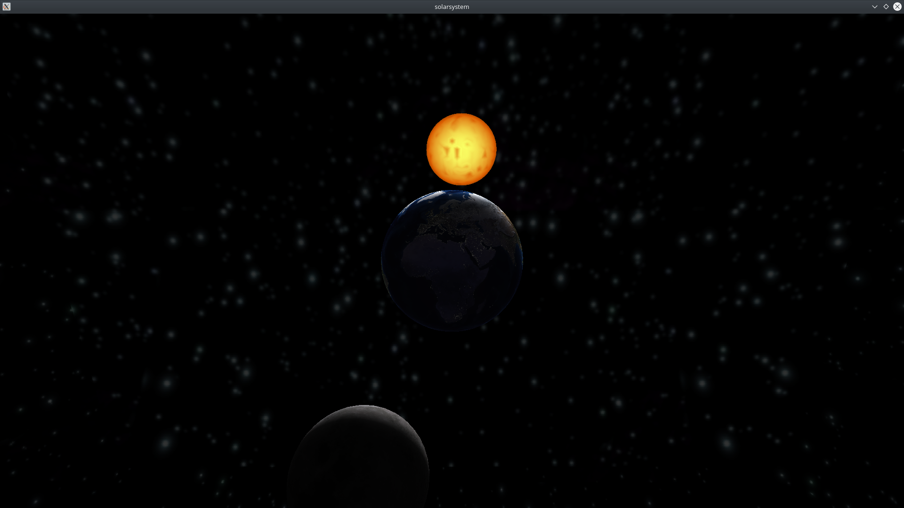

# Système solaire

Création d’un rendu graphique OpenGL <br />

Il s'agit de faire une visualisation du système solaire (Soleil, Terre et la Lune) grâce à un programme OpenGL.
La bibliothèque OpenGL est une interface de programmation regroupant un ensemble de fonctions permettant de générer des images 2D et 3D.  <br />
L’objectif de ce mini projet est d’introduire et de pratiquer les notions principales du pipeline OpenGL à travers la mise en place d’un mini système solaire. Ce dernier inclut la terre, qui tourne sur son axe et est en révolution autour du soleil. Il y a également la lune qui est en révolution autour de la terre. <br />
Vue l'architecture de l'application réalisée, vous pouvez continuer à rajoutant d’autres planètes et leurs lunes pour former un système solaire complet.


## Table des matières
* [Dépendances](#dépendances)
* [Installation](#installation)
* [Architecture de code](#architecture-de-code)
* [Réalisations](#réalisations)


## Dépendances

* [OpenGL](https://www.opengl.org/)
* [SDL2](https://www.libsdl.org/download-2.0.php)
* SDL2\_image (included)
* [GLU](https://www.opengl.org/resources/libraries/)
* [GLEW](http://glew.sourceforge.net/)
* [GLM](http://glm.g-truc.net/0.9.4/index.html)
* [boost](https://www.boost.org/)
* [CMake](https://cmake.org/)


## Installation

Pour lancer le projet, exécuter ces commandes :

```bash
mkdir build
cd build
cmake ..
make
./solar_system

```


## Architecture de code

```bash
├── includes
│   ├── shaders
│   │   ├── earth.frag
│   │   ├── earth.vert
│   │   ├── moon.frag
│   │   ├── moon.vert
│   │   ├── skybox.frag
│   │   ├── skybox.vert
│   │   ├── sun.frag
│   │   └── sun.vert
│   └── textures
│       ├── earth
│       │   ├── morning
│       │   │   ├── earth_xn.png
│       │   │   ├── earth_xp.png
│       │   │   ├── earth_yn.png
│       │   │   ├── earth_yp.png
│       │   │   ├── earth_zn.png
│       │   │   └── earth_zp.png
│       │   └── night
│       │       ├── earth_xn.png
│       │       ├── earth_xp.png
│       │       ├── earth_yn.png
│       │       ├── earth_yp.png
│       │       ├── earth_zn.png
│       │       └── earth_zp.png
│       ├── moon
│       │   ├── moon_xn.png
│       │   ├── moon_xp.png
│       │   ├── moon_yn.png
│       │   ├── moon_yp.png
│       │   ├── moon_zn.png
│       │   └── moon_zp.png
│       ├── skybox
│       │   ├── skybox_xn.png
│       │   ├── skybox_xp.png
│       │   ├── skybox_yn.png
│       │   ├── skybox_yp.png
│       │   ├── skybox_zn.png
│       │   └── skybox_zp.png
│       └── sun
│           └── sun_colors.png
├── CMakeLists.txt
├── src
│   ├── engine
│   │   ├── camera.cpp
│   │   ├── camera.hpp
│   │   ├── Engine.cpp
│   │   ├── Engine.hpp
│   │   ├── EventHandler.cpp
│   │   ├── EventHandler.hpp
│   │   ├── glmUtils.cpp
│   │   ├── glmUtils.hpp
│   │   ├── shader.cpp
│   │   ├── shader.hpp
│   │   ├── shader_object.cpp
│   │   ├── shader_object.hpp
│   │   ├── texture_object.cpp
│   │   └── texture_object.hpp
│   ├── geometry
│   │   ├── cube.cpp
│   │   ├── cube.hpp
│   │   ├── sphere.cpp
│   │   └── sphere.hpp
│   ├── main.cpp
│   ├── models
│   │   ├── earth.cpp
│   │   ├── earth.hpp
│   │   ├── moon.cpp
│   │   ├── moon.hpp
│   │   ├── skybox.cpp
│   │   ├── skybox.hpp
│   │   ├── sun.cpp
│   │   └── sun.hpp
│   ├── SConstruct
│   ├── solar_system.cpp
│   ├── solar_system_globals.hpp
│   └── solar_system.hpp
└── UML
    └── ClassDiagram.pdf

```


## Réalisations

* Programmation par Shaders et VBO
* Shadow Mapping
* Application de textures sur les Objets 3d
* Affichage d’une scène 3D contenant plusieurs objets
* Déplacement de la caméra dans la scène
* Eclairage Ambiant
* Eclairage spéculaire sur certains objets
* Skyboxes





